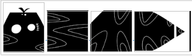
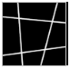
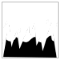
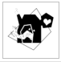
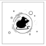
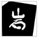
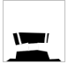
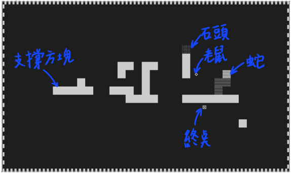

# Gavity snake
>I want to play a game

OS: Linux, Mac  
Requirement: `cmake`

## How to run
Initial:
```bash=
./install_allegro
```
Build:
```bash=
./compileSnakeGame
```
Run:
```bash=
./SnakeGame
```
enjoy!

## 遊戲主體
### 角色
#### 蛇
透過鍵盤操控移動，除非有道具否則長度不變。屬於受重力物件，預設是掉落狀態，會往重力方向掉落。


### 地圖
#### 支撐方塊
若支撐方塊在受重力物件的重力方向旁，該物件變成非掉落狀態。不可推動支撐方塊。



#### 針刺
蛇的任何部位碰到針刺即遊戲失敗。



#### 終點
蛇的頭碰到終點通關成功。



### 道具：（道具必須以蛇頭觸發功能）
#### 老鼠
讓蛇的長度增加一格，不使用時可作為支撐方塊



#### 石頭
屬於受重力物件，預設是掉落狀態，會往重力方向掉落。若石頭是非掉落狀態，且，石頭在受重力物件的重力方向旁，該物件變成非掉落狀態。可以用蛇頭推動石頭，如果石頭推推動方向沒有物件擋住。



#### 按鈕
激發特殊功能（蛇變短、改變地形、改變重力方向）



## 遊戲性
* 挑戰性益智
* 操控蛇
* 與地圖中的物件互動

## 移動
* 蛇上下左右爬
* 受重力物件往重力方向掉落
* 背景與前景移動速度不同（立體感）

## 概念圖

